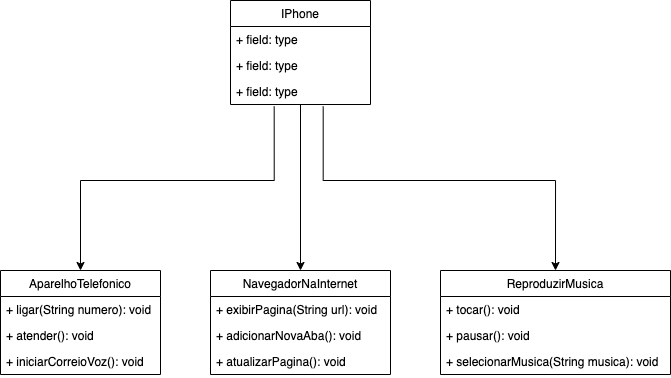

# 📱 Desafio de entrega de classes do iPhone

## 📋 Descrição
Este repósitorio contem a implemetação do diagrama uml proposto para o desafio.
apresentamos o diagrama em pdf e png na pasta src/docs e o código em Java na pasta src/iphone

## 📊 Diagrama UML

  

Nesta seção, apresentamos uma explicação detalhada de cada classe representada no diagrama de classe do projeto. Cada classe desempenha um papel específico e contribui para a funcionalidade global do sistema.

### `iPhone` 

Temos a classe  `iPhone`  que é a classe principal que é uma representação do dispositivo IPhome.
Ela implementa as interfaces propostas:
### `ReprodutorMusical`
### `AparelhoTelefonico`
### `NavegadorInternet`. 

